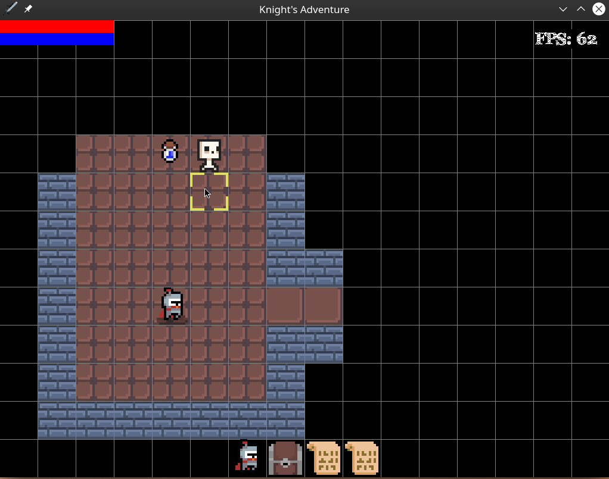
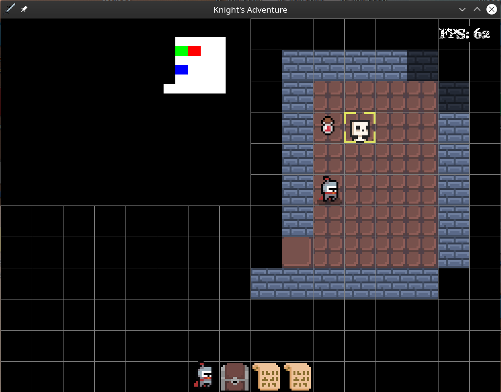

# Roguelike Game
A work in progress roguelike game made with Pygame where the player has to fight enemies and complete a currently undecided objective to win.

Short gameplay

# Controls:

| Key | Action |
|:---:|:---:|
| w   | Walk up |
| a   | Walk left |
| s   | Walk down |
| d   | Walk right |
| q   | Walk diagonally up and left |
| e   | Walk diagonally up and right |
| z   | Walk diagonally down and left |
| c   | Walk diagonally down and right |
| x   | Stay still |
| TAB | Toggle minimap |
| t   | Pickup item |
| ESC | Toggle FOV limitations |
| m   | Toggle camera |
| v   | Auto explore |
| p   | Pause and open menu |
| i   | Toggle inventory screen |
| i + Left mouse click | Use item / Toggle equipment |
| i + Right mouse click | Drop item |
| SPACE | Toggle magic selection screen |
| Left mouse click | Move to mouse cursor |
| SPACE + Left mouse click | Fire spell |
| m + Movement keys | Move camera around |
| m + ENTER | Move to camera location |
| 1 | Transition to previous level |
| 2 | Transition to next level |
| F1 | Make new game |
| F2 | Manually save game |
| F3 | Manually load game |

# Features:
- Animated sprites
- Semi intelligent monster ai
- Random map generation
- Pathfinding
- Field of view
- Player and enemy stats and stat scaling
- Randomly generated monsters and items
- Traversing through floors
- Castable magic
- Inventory system
- Saving and loading

# Upcoming features/todos
- Come up with name
- Different classes
- Win and lose condition
- Major refactoring of code

# Credits:  
## Sprites:
[https://o-lobster.itch.io/simple-dungeon-crawler-16x16-pixel-pack](https://o-lobster.itch.io/simple-dungeon-crawler-16x16-pixel-pack)

[https://alexs-assets.itch.io/16x16-rpg-item-pack](https://alexs-assets.itch.io/16x16-rpg-item-pack)
