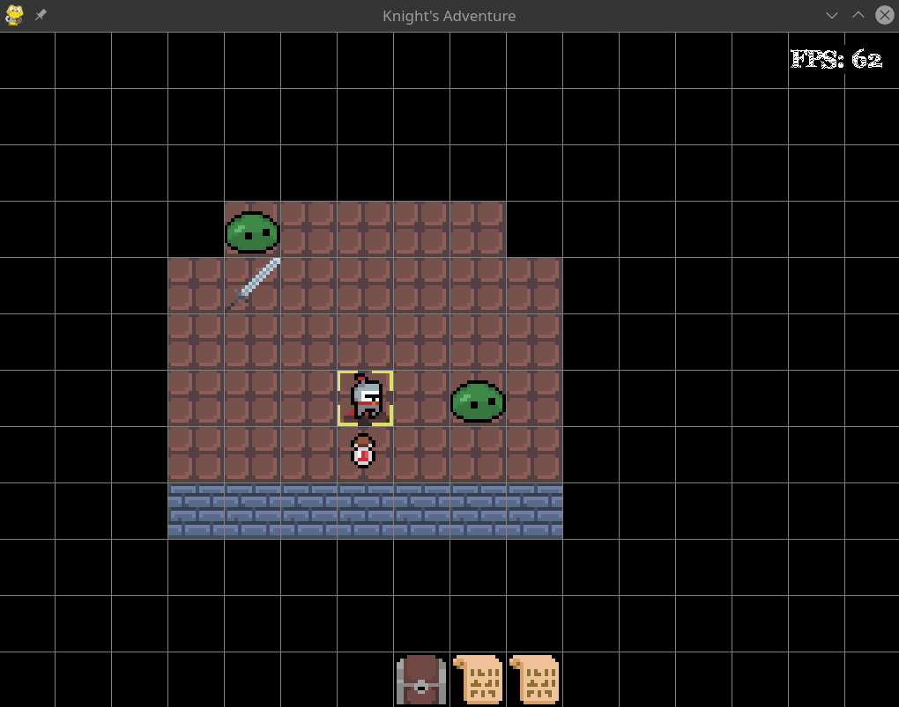
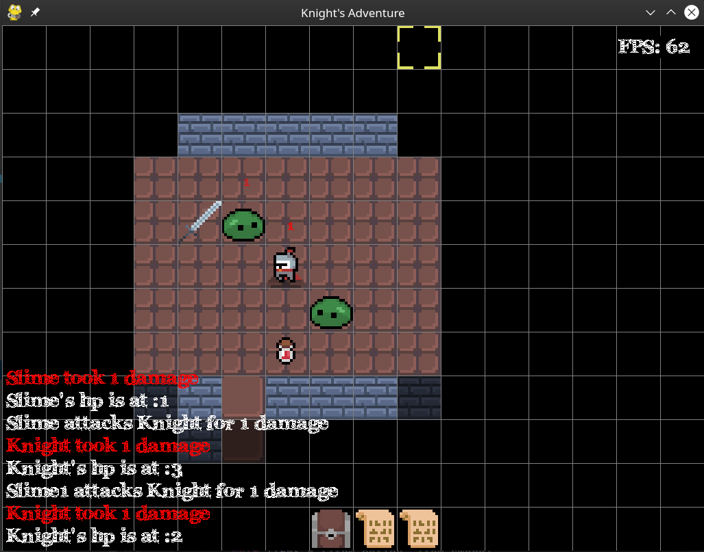
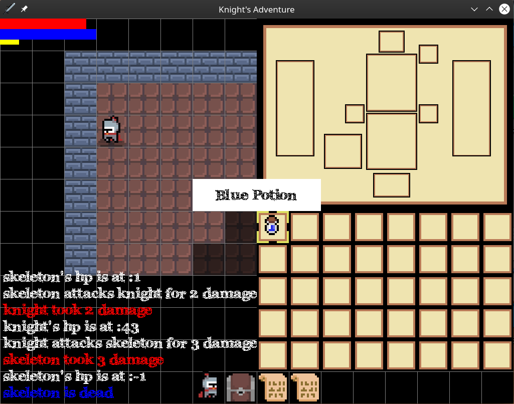

# Roguelike Game
A work in progress roguelike game made with Pygame where the player has to fight enemies and complete a currently undecided objective to win.

# Controls:

| Key | Action |
|:---:|:---:|
| w   | Walk up |
| a   | Walk left |
| s   | Walk down |
| d   | Walk right |
| q   | Walk diagonally up and left |
| e   | Walk diagonally up and right |
| z   | Walk diagonally down and left |
| c   | Walk diagonally down and right |
| x   | Stay still |
| TAB | Toggle minimap |
| t   | Pickup item |
| g   | Drop all items |
| ESC | Toggle FOV limitations |
| m   | Toggle free camera |
| v   | Auto explore |
| p   | Pause |
| I   | Toggle inventory screen |
| SPACE | Toggle magic selection screen |
| Mouse left click | Move to mouse cursor |
| SPACE + Mouse left click | Fire magic spell |
| m + ENTER | Move to camera location |

# Features:
- Animated sprites
- Semi intelligent monster ai
- Random map generation
- Pathfinding
- FOV
- Castable magic (work in progress!)
- Inventory system (work in progress!)

# Upcoming features/todos
- Come up with name
- Finishing item pick up/dropping
- Add magic to cast selection menu 
- Saving and loading
- Traversing through floors
- Randomly generated monsters and items
- Better ai
- Different classes
- Player stats
- Win and lose condition

# Known bugs
- Items, player and enemies sometimes spawn in walls depending on map generation
- Enemies spawning in wall will crash game when trying to move
- Player spawning in wall will crash game when using mouse or free camera to move but no keyboard

# Credits:  
## Sprites:
[https://o-lobster.itch.io/simple-dungeon-crawler-16x16-pixel-pack](https://o-lobster.itch.io/simple-dungeon-crawler-16x16-pixel-pack)

[https://alexs-assets.itch.io/16x16-rpg-item-pack](https://alexs-assets.itch.io/16x16-rpg-item-pack)
